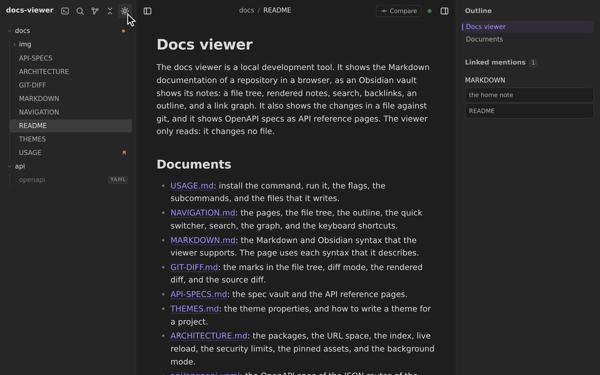

# docs-viewer

A read-only, Obsidian-style viewer for the Markdown documentation of a
repository. Run it in a checkout and read the documents in a browser, with
live reload.



- A file tree, an outline, backlinks, search, a quick switcher, and a link
  graph.
- Obsidian syntax: wikilinks, embeds, callouts, tags, and properties.
- Mermaid diagrams, KaTeX math, and syntax colors. A click opens a diagram,
  an image, or block math in a lightbox with zoom.
- Git: marks in the file tree, and a rendered diff and a source diff of each
  changed file.
- OpenAPI specs as API reference pages.
- Themes: a built-in light and dark theme, or your stylesheet.

It only reads. It does not change the work tree or the git state.

## Install

```sh
go install github.com/benrosenblum/docs-viewer/cmd/docs-viewer@latest
```

Go 1.26 or later. Linux or macOS.

## Use

Run the command from the root of a repository that has a `docs/` directory:

```sh
docs-viewer                       # docs/ on http://127.0.0.1:7000/
docs-viewer -vaults docs,api -spec-vault api -theme ui/docs-theme.css
docs-viewer start                 # in the background; then status, stop
```

The first run downloads the pinned browser assets into `.local/`. Add
`.local/` to the `.gitignore` of the repository.

## Documentation

The documents are in [`docs/`](docs/README.md). Start with
[`docs/USAGE.md`](docs/USAGE.md). To read them in the viewer, run
`make docs` in this repo.
