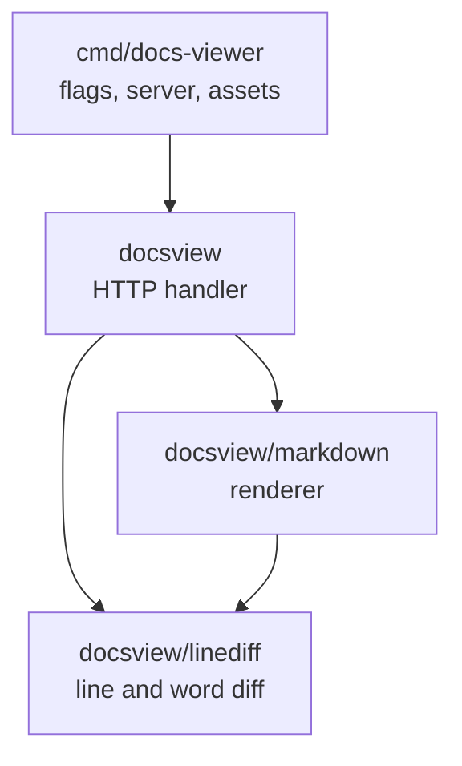
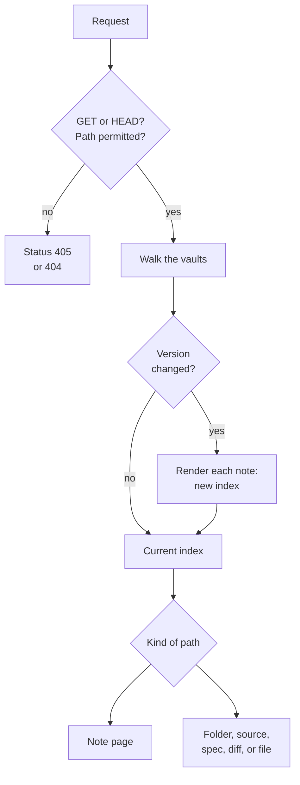
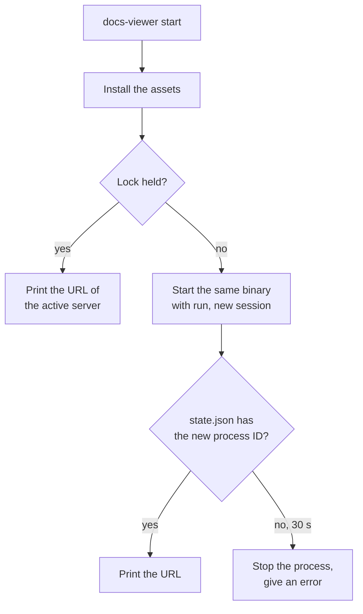

# Architecture

This document describes the parts of the viewer: the packages, the URL
space, the index, live reload, the security limits, the pinned assets, and
the background mode.

## Packages



| Package | Function |
|---------|----------|
| `cmd/docs-viewer` | The command: the flags, the subcommands, the HTTP server, the install of the pinned assets, and the background mode. |
| `docsview` | The HTTP handler: the routes, the index of the vaults, the pages, search, the graph, live reload, and the git diff pages. |
| `docsview/markdown` | The renderer: Markdown with the Obsidian syntax to HTML, the link data of a note, the syntax colors, and the rendered diff. |
| `docsview/linediff` | The diff of two lists of strings (Myers algorithm), the hunks, the pairs, and the word ranges. |

These rules apply:

- A package imports only packages that are below it in the diagram.
  `linediff` uses the standard library only.
- `markdown` knows no HTTP and no file system. It reads other notes only
  through the `Resolver` interface. `docsview` implements that interface
  from its index.
- `docsview` only reads. It reads the repository through `os.Root`, and
  git through read-only commands.
- Only `cmd/docs-viewer` uses the network and writes files. All its files
  are below `.local/`.

The browser files are in `docsview/static`: `viewer.css`, `theme.css`,
`viewer.js`, `graph.js`, `theme.js`, and `icons.svg`. They are plain
files, without a framework and without a build step. The one page
template is `docsview/templates/layout.html`. The binary embeds these
files.

## URL space

Each path below `/_/` belongs to the viewer. Each other path is a
repository path.

| Path | Response |
|------|----------|
| `/` | A redirect to the home note: `README.md` in the first vault, else the folder page of the first vault. |
| `/_/static/<file>` | An embedded `.js`, `.css`, or `.svg` file. `highlight.css` is not a file: the handler generates it from the chroma styles. |
| `/_/theme/<path>` | A `.css` or `.woff2` file below the directory of the custom theme. See [THEMES.md](THEMES.md). |
| `/_/assets/<version>/<path>` | A pinned asset. The browser can keep it, because the version is in the URL. |
| `/_/api/index` | JSON: the notes of the vaults, for the quick switcher. |
| `/_/api/search?q=` | JSON: the search results. |
| `/_/api/graph` | JSON: the nodes and the links of the graph. |
| `/_/api/history?path=` | JSON: the commits that changed a file. |
| `/_/events?path=` | The live reload event stream. |
| `/_/search?q=` | The search results as a page. |
| `/_/graph` | The graph page. |
| Other `/_/` paths | The "Not found" page, status 404. |
| Other paths | A repository path: a note, a folder, a source page, an API reference, a diff, or the file itself. |

The [API spec](../api/openapi.yaml) describes the JSON routes and the
event stream.

A repository path accepts these query parameters:

| Parameter | Function |
|-----------|----------|
| `raw=1` | Gives the file as plain text. |
| `diff`, `as` | Select the diff. See [GIT-DIFF.md](GIT-DIFF.md#url-parameters). |
| `view=source` | Shows a spec as source. See [API-SPECS.md](API-SPECS.md#pages-of-a-spec). |

## Index

The index is a snapshot of the vaults in memory. It gives the file tree,
the backlinks, the search text, and the graph.

To make the index, the handler does these steps:

1. It walks each vault and reads the size and the modification time of
   each file. A hash of these values is the **vault version**.
2. It reads each note and its headings.
3. It renders each note one time. The result has the HTML, the links, the
   tags, the title, and the aliases.
4. It records each file outside the vaults that a note links to or embeds.
   The state of these files is also part of the version.

The handler does the walk for each request for a page or for JSON. It
makes a new index only when the version is different. An index does not
change after it is made, so requests can share it.

## How a request is served



For a repository path, the handler selects the page as follows:

1. A folder gives the folder page. A folder URL without the last `/` gets
   a redirect.
2. A file with a diff base gives the diff page. See
   [GIT-DIFF.md](GIT-DIFF.md).
3. A note gives the note page. The HTML of a vault note comes from the
   index. A note outside the vaults renders for the request.
4. An image, a PDF file, or a `raw=1` request gives the bytes of the file.
5. A YAML file in the spec vault gives the API reference page.
6. Other text gives the source page.

The server renders each page in full. The script `viewer.js` then adds the
behavior: it gets the next page with `fetch` and replaces the parts of the
page, so that a link does not cause a full page load. Mermaid, KaTeX, and
Redoc run in the browser.

## Live reload

The page opens an event stream at `/_/events?path=<repository path>`
(Server-Sent Events).

1. The handler sends a `hello` event with the current version.
2. Each 500 ms, the handler calculates two values for the connection: the
   **tree state** and the **page state**.
3. When a value is different, the handler sends a `change` event. The
   event says which of the two changed.
4. The page gets its URL again and replaces the changed parts. It keeps
   the scroll position.

| Value | Contents |
|-------|----------|
| Tree state | The vault version. With git, also a digest of the tree marks, the branch, and the `HEAD` commit. |
| Page state | The size and the modification time of the open file. For a vault note, also a hash of its HTML. With git, also the `HEAD` commit and the mark of the file. |

The hash of the HTML is necessary because a note can change when its file
does not. For example, a new file makes an unresolved link in another note
resolve.

Each 15 seconds, the handler sends a comment line, so that the connection
stays open. When the connection breaks, the browser connects again. If the
version in the new `hello` event is different, the page updates.

The poll does no work when no page is open. Each open page costs one walk
of the vaults for each 500 ms.

## Security

The viewer is a tool for one developer on one computer. These limits keep
it safe to run in a repository:

- **Address**: the default address is `127.0.0.1:7000`, which accepts
  connections only from the same computer. The viewer has no sign-in.
- **Methods**: the handler accepts only `GET` and `HEAD`. Other methods
  get status 405. No request writes a file.
- **Confinement**: the handler opens files through `os.Root` handles: one
  for the repository, one for the pinned assets, and one for the theme
  directory. A path cannot leave its root, also not through `..` or a
  symbolic link.
- **Excluded paths**: the handler refuses a path with a segment that
  starts with `.`, a segment `node_modules`, or a first segment `_`. It
  also refuses a symbolic link whose target is such a path. The file tree
  does not list a symbolic link to a directory.
- **Response headers**: each response has the content security policy,
  `X-Content-Type-Options: nosniff`, `Referrer-Policy: no-referrer`, and
  `Cache-Control: no-store`. Only the pinned assets permit the browser to
  keep them.
- **Git**: the commands only read, have a time limit, and get no URL value
  as an option. See [GIT-DIFF.md](GIT-DIFF.md#git-commands).

The content security policy permits only the origin of the viewer:

```text
default-src 'self'; script-src 'self'; style-src 'self' 'unsafe-inline';
img-src 'self' data:; font-src 'self' data:; connect-src 'self';
object-src 'none'; frame-src 'none'; frame-ancestors 'none';
base-uri 'self'; form-action 'self'
```

- The browser loads no script, stylesheet, font, or image from another
  host.
- Raw HTML in a note shows, but a script in it does not run.
- `style-src` permits inline styles, because Mermaid and KaTeX set them.
- An SVG file that opens as a file gets a stricter policy with `sandbox`.
- The API reference page adds `worker-src 'self' blob:`. See
  [API-SPECS.md](API-SPECS.md#content-security-policy).
- A link to another host opens in a new tab, without a referrer.

### Limits

| Limit | Value |
|-------|-------|
| The size of a note | 8 MiB |
| The size of a source page | 2 MiB |
| The size of a note for the rendered diff | 1 MiB |
| The size of a file for syntax colors in the source diff | 256 KiB |
| The depth of embeds in embeds | 3 |
| The commits in a file history | 100 |
| The notes in the search results | 50, with 5 text lines for each note |
| The time for one git command | 5 seconds |

A file above a limit gets a message in the page. The viewer does not read
it into memory.

## Pinned assets

Mermaid, KaTeX, and Redoc are not in the repository of the viewer. The
manifest `cmd/docs-viewer/docs-assets.json` pins them, and the binary
embeds the manifest.

```json
{
  "assets": [
    {
      "name": "mermaid",
      "version": "11.17.2",
      "url": "https://registry.npmjs.org/mermaid/-/mermaid-11.17.2.tgz",
      "sha256": "<SHA-256 of the archive>",
      "license": "MIT",
      "files": {
        "package/dist/mermaid.min.js": {
          "path": "mermaid.min.js",
          "sha256": "<SHA-256 of the file>"
        }
      }
    }
  ]
}
```

| Field | Contents |
|-------|----------|
| `name` | The directory of the asset in the bundle, and the first part of its URL path. |
| `version`, `license` | Information for the reader. They must not be empty. |
| `url` | The archive (`.tgz`) to download. |
| `sha256` | The SHA-256 value of the archive, in hexadecimal. |
| `files` | The files to take from the archive. The key is the path in the archive. `path` is the path in the bundle. `sha256` is the value of the file. |

The install does these steps:

1. It checks the files of `.local/tools/docs/bundle-<hash>/` against the
   manifest. If all are correct, the install is complete, without network
   access.
2. It takes the lock `.local/tools/docs/install.lock`, so that two
   installs in one checkout do not mix.
3. It downloads each archive and checks its SHA-256 value.
4. It writes the listed files to a temporary directory and checks each
   one.
5. It renames the temporary directory to `bundle-<hash>`.

`<hash>` is the first 16 characters of the SHA-256 value of the manifest.
It is also the `<version>` in `/_/assets/<version>/`. Thus, a changed
manifest gives a new directory and new URLs, and the browser cannot use an
old file.

### Change a pinned version

1. Get the new archive and calculate its value:

   ```sh
   curl -sSLo mermaid.tgz https://registry.npmjs.org/mermaid/-/mermaid-<version>.tgz
   sha256sum mermaid.tgz
   ```

2. Calculate the value of each file in `files`:

   ```sh
   tar -xzOf mermaid.tgz package/dist/mermaid.min.js | sha256sum
   ```

   On macOS, use `shasum -a 256` as an alternative to `sha256sum`.

3. Edit `cmd/docs-viewer/docs-assets.json`: the `version`, the `url`, the
   `sha256` of the archive, and the `sha256` of each file.
4. If a file name changed, change it also in
   `docsview/templates/layout.html` and in `docsview/static/viewer.js`.
5. Build the command again, because the binary embeds the manifest.
6. Run `docs-viewer setup`. The install fails if a value is wrong.
7. Open a page with a diagram, a page with math, and an API reference
   page. Examine them in light and in dark.

The old `bundle-<hash>` directory stays until you delete it.

## Background mode

A checkout has one server at a time. Two files in `.local/run/docs/`
control this:

| File | Function |
|------|----------|
| `lock` | The server holds a write lock on this file while it runs. The operating system releases the lock when the process stops, also after a failure. Thus, a stopped server never looks active. |
| `state.json` | The server writes its process ID and its URL here when it listens: `{"pid": 41234, "url": "http://127.0.0.1:7000/"}`. It removes the file when it stops. |

The subcommands ask the operating system which process holds the lock.
They do not take the lock themselves, so a query cannot collide with a
server that starts.



- `start` installs the assets in the foreground, so that a download error
  shows in the terminal.
- `start` runs the same binary again with the same flags and the
  subcommand `run`. The new process is in its own session, so Ctrl+C and
  the end of the terminal session do not stop it. Its output goes to
  `.local/logs/docs.log`.
- `stop` sends `SIGTERM` and waits until the lock is free, for a maximum
  of 10 seconds. Then it sends `SIGKILL`.
- When the server gets `SIGINT` or `SIGTERM`, it ends the event streams
  first. Then it completes the open requests, for a maximum of 5 seconds.

Because `start` runs the binary again, the binary must stay at its path.
Do not use `go run` for `start`: its binary is temporary.

## How it was checked

| Test file | Subject |
|-----------|---------|
| `docsview/docsview_test.go` | The routes, the excluded paths, wikilink resolution, search, the graph, the labels of notes with the same name, the live reload events, and themes. |
| `docsview/apispec_test.go` | The spec vault. |
| `docsview/git_test.go`, `diffpage_test.go`, `diffview_test.go` | Git access and the diff pages. |
| `docsview/markdown` | The renderer, and `TestRealDocs`, which renders each document in `docs/`. |
| `docsview/linediff` | The line diff and the word diff. |
| `cmd/docs-viewer` | The asset install (a broken archive, use without network, the repair of a changed file), and the background mode. |

The tests use temporary directories and no network.
