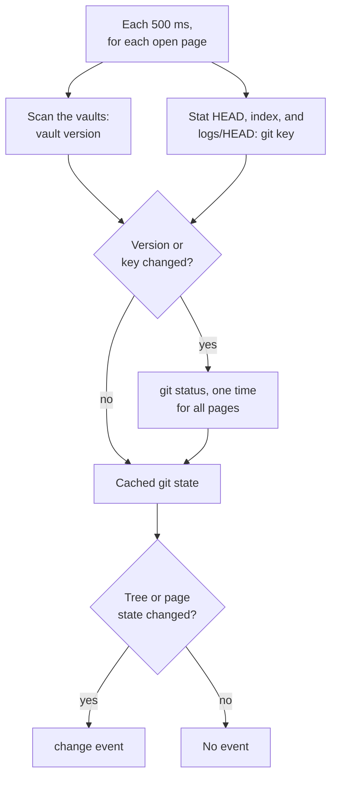

# Git diff

The viewer shows the changes in a file against git. A changed file has a
mark in the file tree, and a file page can show a diff. A note has two
forms of diff: a rendered diff and a source diff.

The viewer reads the git state with the `git` command line tool. It needs
`git` on `PATH`. It needs no other setup.

The viewer only reads. It does not write to the work tree, the index, or
any file in `.git`.

## Marks in the file tree

A vault file with uncommitted changes against `HEAD` has a letter after
its name:

| Mark | Meaning |
|------|---------|
| `M` | Modified: a tracked file with changes, staged or not. |
| `A` | Added: a new file that is staged, or a renamed file. |
| `U` | Untracked: a new file that git does not track. |

A folder that contains a marked file, at any depth, has a dot. A deleted
file is not in the tree, so it has no mark. A clean work tree shows no
marks.

## Diff mode

A file page can show a diff. The diff always compares a **base** version
of the file with the current file in the work tree.

- When a file has uncommitted changes, its page opens in diff mode, with
  `HEAD` as the base. This applies to a bare URL, such as
  `/docs/USAGE.md`.
- When a file has no uncommitted changes, its page opens as the normal
  page.
- The header controls select another mode. The URL keeps the selection.

Images and PDF files are the exception: a bare URL always gives the file
itself, because notes embed images with the bare URL. To see the diff page
of a changed image, add `?diff=HEAD` to its URL. The page says that the
file is binary.

## URL parameters

| Parameter | Value | Page |
|-----------|-------|------|
| `diff` | not set | The diff against `HEAD` if the file has uncommitted changes, else the normal page. |
| `diff` | `off` | The normal page. |
| `diff` | `HEAD` | The diff against `HEAD`. |
| `diff` | `branch` | The diff against the merge base of `HEAD` and the main branch. |
| `diff` | 7 to 64 hexadecimal characters | The diff against that commit. |
| `as` | `source` | The source diff of a note. Without it, a note shows the rendered diff. |

The viewer finds the main branch by name. It uses the first of these
branches that exists:

1. The local branch `main`.
2. The local branch `master`.
3. `origin/main`.
4. `origin/master`.

Any other `diff` value gets status 400 and an error message in the viewer
layout. So does a hash that does not name a commit, and `branch` in a
repository without a main branch. The viewer never gives a URL value to
git as an option.

`?raw=1` always gives the current file and ignores `diff`.

Only a bare URL changes its mode on live reload. A URL with `diff=off` or
`diff=HEAD` keeps its mode.

## Header controls

A file page has these controls in its header:

- **Page / Changes**: shows the normal page (`diff=off`) or the changes.
  This control shows in diff mode and on the normal page of a changed
  file.
- **Rendered / Source**: selects the form of the diff of a note.
- **The change count**: the number of changes that the page shows, such as
  "5 changes". See [Change count](#change-count).
- **The base picker**: the button shows the base ("Uncommitted", "Branch",
  or a short hash), or "Compare" on the normal page. It opens a list:
  1. "Uncommitted changes": the base is `HEAD`.
  2. "Branch changes": the base is the merge base with the main branch.
     This entry shows only when the main branch exists and the current
     branch is a different branch.
  3. The commits that changed the file, newest first, with renames
     followed. Each entry shows the subject, the short hash, the author,
     and the date, and the old path if the file had another path. The list
     has a maximum of 100 commits.
  4. "Normal page".

  Use the arrow keys to move in the list, Enter to open an entry, and
  Escape to close the list.

Each control changes the page without a full page load. The back button of
the browser returns to the previous mode.

## Rendered diff

The rendered diff is the default form for a note. It shows the note as the
viewer renders it. Links, embeds, callouts, math, and Mermaid diagrams
render as on the normal page.

- A block that is only in the current file has a green mark (added).
- A block that is only in the base version has a red mark (removed), at
  the position where it was.
- A changed block shows its base version with a red mark, then its current
  version with a green mark.
- A change to the front matter gives the properties section an orange
  mark. The section shows the current values. The source diff shows the
  exact change.

The marks apply to the smallest block that changed: a paragraph, a
heading, a list item, a code block, a math block, an HTML block, a rule,
or a table row. In a list, a block quote, or a callout, only the changed
item or inner block has a mark. A change to the header row or the
delimiter row of a table marks the full table: the base table as removed,
then the current table as added.

The viewer makes the rendered diff from one merged Markdown source. The
source has the unchanged lines one time. For each change, it has the old
lines and then the new lines of each block that the change touches. The
renderer marks each block from the origin of its lines.

A note larger than 1 MiB, or a merged source that does not render, shows
the source diff with a message.

## Source diff

The source diff is the only form for a file that is not a note, and the
second form for a note. It is a unified diff of the lines, with syntax
colors, the old and the new line numbers, and a `+` or `-` marker.

- Three unchanged lines show around each change.
- A longer run of unchanged lines collapses into one row, such as "35
  unchanged lines". Select the row to show the lines in place.
- A file larger than 256 KiB shows the lines without syntax colors.

A diff page shows a message and no lines in these cases:

| Case | Message |
|------|---------|
| A version is binary. | The file is binary. The viewer does not show a diff of a binary file. |
| A version is above the display limit (8 MiB for a note, 2 MiB for other files). | The file is too large to show a diff. |
| The two versions are equal. | The file has no changes against HEAD. (The message names the base.) |
| The file is new and has no content. | The file is new and empty. |

When the total of removed and added lines is more than 10 000, the viewer
does not calculate an exact diff. The page then shows all the lines from
the first change to the last change as removed, then as added, with a
message.

## Word marks

The two forms also mark the changed words in a changed line or block.

- In each change, the first removed line pairs with the first added line,
  the second with the second, and so on. Lines without a pair have no word
  marks. The rendered diff pairs blocks in the same way, but only two
  blocks of the same kind: two paragraphs, two headings, two list items,
  or two table rows. A table row compares its cells column by column.
- A word is a run of letters, digits, and underscores. Each other
  character that is not a space is a word of its own. Changed words that
  only spaces divide get one mark.
- Removed words have a stronger red background, and added words a stronger
  green background. In the rendered diff, removed words also have a line
  through them.
- In the rendered diff, a word mark keeps the formatting: a changed word
  in a link stays in the link, and the link still works. An inline code
  span, inline math, a wikilink, a tag, or an image is one word.

Word marks do not show in these cases:

- Less than half of the text of the pair is the same. Then the pair shows
  only its line or block marks.
- A line or a block is longer than 10 000 bytes.
- The block is a code block, a math block, a diagram, an HTML block, or a
  table that changed its header row. These blocks get block marks only.
  The source diff shows their word changes.

## Change count

The header of a diff page shows the number of changes, such as
"5 changes". One change is:

- In the rendered diff: a group of adjacent marked blocks. The base
  version and the current version of a changed block are one change. The
  properties section with an orange mark is also one change.
- In the source diff: a group of adjacent removed and added lines.

Thus the two forms can show different counts for the same file.

- A change that has no mark is not in the count. For example, the rendered
  diff does not show a comment (`%% ... %%`), so a changed comment is not a
  change there.
- A page with a message and no lines shows no count.
- In a window narrower than 480 pixels, the header hides the count.

The first element of each change has the attribute `data-change`. The
count is the number of these elements.

## Live reload

The open page and the tree update without a manual reload after a file
edit, a commit, a stage, an unstage, a reset, or a branch change.



- The git key is the size and the modification time of three files in the
  git directory: `HEAD`, `index`, and `logs/HEAD`.
- The viewer runs `git status` only when the git key or the vault version
  changes. All open pages share the result.
- The tree state is the vault version and a digest of the marks. The page
  state is the state of the open file, the `HEAD` commit, and the mark of
  the file.
- A commit changes the `HEAD` commit, so the page reloads. A bare URL then
  obeys the rule of diff mode: after a commit, it shows the normal page.
- A stage of an untracked file changes its mark from `U` to `A`. A stage
  of a modified file does not change its mark, so the page does not
  reload.

[ARCHITECTURE.md](ARCHITECTURE.md#live-reload) describes the event stream.

## Hover previews and other views

A hover preview shows the normal note, also for a note with changes: the
preview request adds `diff=off`. Search, backlinks, and the graph use the
current files and show no diff.

## Without git

The diff features are off in these cases:

- `git` is not on `PATH`.
- The repository root is not in a git work tree.
- Git refuses to read the repository.

The viewer then shows no tree marks and no header controls, and has no
diff mode. The URL parameters have no effect. At the start, the log has
one line with the cause:

```text
2026/10/05 09:30:00 WARN docs viewer diff features are off reason="git rev-parse: exec: \"git\": executable file not found in $PATH"
```

The repository root can be a folder below the top level of the git work
tree. The viewer then shows the marks and the history of the files below
that folder.

## History API

`/_/api/history?path=<repository path>` returns the history of a file as
JSON. The base picker calls it when it opens.

```json
{
  "branch": "add-search-filters",
  "main": "main",
  "branchBase": true,
  "commits": [
    {
      "hash": "9f2c1e7a4b3d5c6e8f0a1b2c3d4e5f60718293a4",
      "short": "9f2c1e7",
      "subject": "(docs) Describe the search filters",
      "author": "A. Writer",
      "date": "2026-09-26T11:44:07-04:00",
      "path": "docs/NAVIGATION.md"
    }
  ]
}
```

| Field | Contents |
|-------|----------|
| `branch` | The current branch. Empty when `HEAD` is detached. |
| `main` | The main branch: `main`, `master`, or empty when the repository has none. |
| `branchBase` | True when the picker can offer "Branch changes". |
| `commits` | The commits that changed the file, newest first. `path` is the path of the file at that commit. |

A path that the viewer does not show, or a viewer without git, gets status
404. The [API spec](../api/openapi.yaml) describes this route and the
other JSON routes.

## Git commands

Each git command starts with these options:

```sh
git --no-optional-locks --literal-pathspecs -c core.quotepath=off -c color.ui=never
```

- Each command has a time limit of 5 seconds.
- The environment has `GIT_OPTIONAL_LOCKS=0`, `GIT_TERMINAL_PROMPT=0`, and
  `LC_ALL=C`. The viewer removes all other `GIT_` variables, because such
  a variable can select another repository.
- Revisions come after `--end-of-options`, and paths after `--`.
- The commands are `rev-parse`, `status --porcelain=v2`, `log --follow`,
  `cat-file`, and `merge-base`. None of them writes.

`--no-optional-locks` is necessary. Without it, `git status` writes
`.git/index` again. That changes the git key and causes a reload loop.

## How it was checked

The Go tests use temporary repositories and need `git` on `PATH`:

- `docsview/git_test.go`: the detection of the work tree, the base
  grammar, the status marks, the history with renames, and the content of
  a file at a commit.
- `docsview/diffpage_test.go`: diff mode, the URL parameters, the change
  count in the header, the tree marks, the history route, live reload from
  git, and a viewer without git.
- `docsview/diffview_test.go`: the source diff, and its change count.
- `docsview/linediff`: the line diff, the hunks, the pairs, and the word
  marks.
- `docsview/markdown/diff_test.go`: the diff units, the merged source
  (with random edits), the rendered diff, the word marks, and the change
  count. Each case compares the count with the number of `data-change`
  elements.
