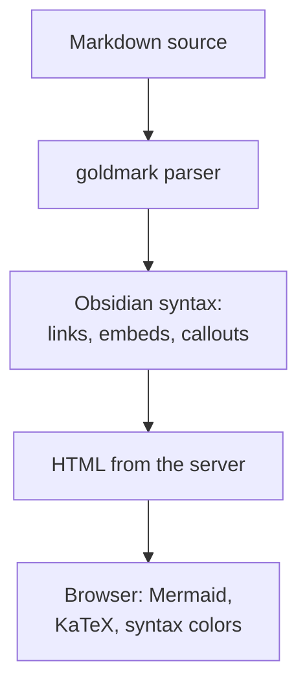

# Markdown support

The server renders Markdown with
[goldmark](https://github.com/yuin/goldmark). The viewer supports
CommonMark, the GitHub extensions, and a part of the Obsidian syntax.

This page uses each syntax that it describes. Thus, it is also a test page
for the renderer: compare the source (`?raw=1`) with the page.

## Properties

A note can start with YAML front matter between two `---` lines. The
viewer shows the keys as the "Properties" section at the top of the note.
This page starts with this front matter:

```yaml
---
title: Markdown support
aliases:
  - Syntax reference
  - Obsidian syntax
tags:
  - reference
  - syntax
related:
  - "[[NAVIGATION]]"
  - "[[GIT-DIFF|Git diff]]"
status: complete
---
```

| Key | Function |
|-----|----------|
| `title` | The title of the note in the browser tab, in the quick switcher, and in search. Without it, the title is the first heading of level 1. |
| `aliases` | Other names of the note. The quick switcher and search find the note by an alias. |
| `tags` | The tags of the note, without `#`. Each tag is a link to its search. |
| Any other key | The viewer shows the value. A list shows as a row of values. |

A value that is one wikilink in quotation marks becomes a link, as
`related` shows. Without the quotation marks, YAML reads `[[...]]` as a
list in a list, and the value is not a link.

If the YAML is not valid, the section shows the error, and the text below
it renders as usual.

## Headings

A line that starts with one to six `#` characters is a heading. Each
heading gets an ID for links. The ID obeys the rules of GitHub:

- Letters become lower case.
- Each space becomes `-`.
- Punctuation is removed. The characters `-` and `_` stay.
- The second heading with the same text gets `-1` at its end, the third
  `-2`.

For example, the heading "Files under `.local/`" has the ID
`files-under-local`. Thus, a link such as `USAGE.md#files-under-local`
works in the viewer and on a git host.

### Level 3

#### Level 4

##### Level 5

###### Level 6

The outline in the right sidebar shows all six levels.

## Text

| Syntax | Result |
|--------|--------|
| `**bold**` | **bold** |
| `*italic*` | *italic* |
| `~~removed~~` | ~~removed~~ |
| `==highlight==` | ==highlight== |
| `` `code` `` | `code` |
| `<kbd>Ctrl</kbd>` | <kbd>Ctrl</kbd> |
| `https://commonmark.org` | https://commonmark.org |

A link to another host opens in a new tab and shows a small arrow.

### Comments

Text between two `%%` markers is a comment. The page does not show it.
This sentence has a comment at its end. %%The reader does not see this text.%%

A comment can also be a block of lines. One such block is below this
paragraph in the source.

%%
This block is a comment.
The page does not show it.
%%

### Raw HTML

Raw HTML shows in the page. A script in it does not run. Press
<kbd>Ctrl</kbd>+<kbd>O</kbd> to open the quick switcher.

<details>
<summary>A <code>details</code> element</summary>

Markdown after an empty line renders in an HTML block: **bold**, `code`.

</details>

## Lists

- A bullet list.
- A second item.
  - An item at the second level.
  - One more.
    1. A numbered item at the third level.
    2. A second numbered item.

1. A numbered list.
2. A second item.

A task list shows check boxes. The viewer does not change them.

- [x] Render the note on the server.
- [x] Find the links for the backlinks and the graph.
- [ ] Edit the note. The viewer does not do this.

## Tables

A table uses the GitHub syntax. A colon in the second row sets the
alignment of a column.

| Mark | Meaning | Count |
|:-----|:-------:|------:|
| `M` | Modified | 12 |
| `A` | Added | 3 |
| `U` | Untracked | 1 |

In a table cell, write a backslash before each `|` character that is not
a column separator. This also applies to a wikilink with other text:

| Syntax | Result |
|--------|--------|
| `[[THEMES\|the theme properties]]` | [[THEMES\|the theme properties]] |

## Footnotes

A footnote has a mark in the text and a definition in a different
location of the file. goldmark is the parser[^goldmark], and chroma gives
the syntax colors[^chroma]. The definitions show at the end of the page.

## Links

### Standard links

| Syntax | Target | Example |
|--------|--------|---------|
| `[text](USAGE.md)` | A path relative to the folder of the note. | [USAGE.md](USAGE.md) |
| `[text](USAGE.md#flags)` | A heading, by its ID. | [the flags](USAGE.md#flags) |
| `[text](#limits)` | A heading of the same page. | [the limits](#limits) |
| `[text](/docs/README.md)` | A path from the repository root. | [the home note](/docs/README.md) |
| `[text](../api/openapi.yaml)` | A file that is not a note. | [the API spec](../api/openapi.yaml) |

A relative link works in the viewer and on a git host. A link to a file
that does not exist shows as an unresolved link: lighter, with a dashed
line.

### Wikilinks

A wikilink is a link in two pairs of square brackets.

- `[[USAGE]]` links to a note by its name: [[USAGE]].
- `[[USAGE|how to run the viewer]]` shows other text:
  [[USAGE|how to run the viewer]].
- `[[USAGE#Flags]]` links to a heading by its text: [[USAGE#Flags]].
- `[[USAGE#Flags|the flags]]` does the two: [[USAGE#Flags|the flags]].
- `[[#Callouts]]` links to a heading of this page: [[#Callouts]].
- `[[#^resolution]]` links to a block of this page: [[#^resolution]].
- `[[MARKDOWN#^resolution]]` links to a block of a note:
  [[MARKDOWN#^resolution]].

A wikilink finds its target by name, as in Obsidian. The `.md` extension
is optional. The viewer tries these locations in sequence and uses the
first file that it finds. ^resolution

1. A path relative to the folder of the note.
2. A path from the vault of the note.
3. A path from each other vault, in the sequence of `-vaults`.
4. A path from the repository root to a file in a vault, such as
   `[[api/openapi.yaml]]`.
5. A file in a vault whose path ends with the target, for a target with a
   `/`.
6. A file in a vault with that name. If many files have that name, a file
   in the folder of the note comes first, then the file with the shortest
   path.

A target that starts with `./` or `../` uses only the first location. A
wikilink that finds no file shows as an unresolved link, and the graph can
show it as a node.

The heading of a wikilink is the text of the heading, not its ID. Letter
case and repeated spaces make no difference.

### Block IDs

A paragraph or a list item that ends with a space and `^name` gets the ID
`^name`. The name has letters, digits, and `-`. The page does not show
the marker. The paragraph before the numbered list above ends with
`^resolution` in the source.

- A list item can also have a block ID. ^list-block
- The link `[[#^list-block]]` goes to the item above: [[#^list-block]].

## Embeds

An embed is a wikilink with `!` before it. It shows the content of the
target in the page.

| Syntax | Result |
|--------|--------|
| `![[note]]` | The full note, without its front matter. |
| `![[note#Heading]]` | The section of that heading: the heading and the text to the subsequent heading of the same or a higher level. |
| `![[note#^name]]` | The block with that ID. |
| `![[image.png]]` | The image. |
| `![[image.png\|300]]` | The image with a width of 300 pixels. |
| `![[image.png\|300x200]]` | The image with a width and a height. |
| `![[file.pdf]]` | A link to the file. Only notes and images show their content. |

### A section of a note

The line `![[NAVIGATION#Keyboard shortcuts]]` embeds one section of
[NAVIGATION.md](NAVIGATION.md):

![[NAVIGATION#Keyboard shortcuts]]

### A note

The line `![[README]]` embeds the home note:

![[README]]

An embed can contain embeds, to a depth of three. A note that embeds
itself shows a link at that position.

### An image

The line `![[img/layout.svg|560]]` embeds an image with a width of 560
pixels:

![[img/layout.svg|560]]

The standard syntax `` also works.

## Callouts

A callout is a block quote whose first line is `[!type]`. Text after the
type is the title. Without a title, the type is the title.

```markdown
> [!tip] A title
> The text of the callout.
```

> [!note]
> A callout without a title. It can contain **formatting**, `code`, and
> links such as [[USAGE]].

> [!tip] Start with the home note
> The home note is `README.md` in the first vault.

> [!warning] The viewer has no sign-in
> Keep the loopback address, as [USAGE.md](USAGE.md#flags) tells you.

> [!danger] A wrong checksum stops the install
> The command then writes no asset file.

Add `-` after the type for a foldable callout that starts closed. Add `+`
for one that starts open.

> [!example]- A closed foldable callout: select the title to open it
> A callout can contain other blocks:
>
> - a list,
> - a table, or
> - a code block.
>
> ```sh
> docs-viewer status
> ```

> [!question]+ An open foldable callout
> Select the title to close it.

> [!quote] A callout in a callout
> The outer callout.
>
> > [!success] Inner callout
> > The inner callout.

The viewer has these types. Each alias gives the same color and icon as
its type. An unknown type has the look of `note`.

| Type | Aliases |
|------|---------|
| `note` | |
| `abstract` | `summary`, `tldr` |
| `info` | |
| `todo` | |
| `tip` | `hint`, `important` |
| `success` | `check`, `done` |
| `question` | `help`, `faq` |
| `warning` | `caution`, `attention` |
| `failure` | `fail`, `missing` |
| `danger` | `error` |
| `bug` | |
| `example` | |
| `quote` | `cite` |

## Tags

A tag is `#` and a name, after a space or at the start of a line. The name
has letters, digits, `_`, `-`, and `/`. A `/` makes a tag below another
tag.

This page has the tags #reference and #syntax/obsidian in its text. A tag
is a link: it opens the search for that tag. The search `tag:#syntax`
finds this page, because the page has the tag `syntax` in its front matter
and the tag `syntax/obsidian` in its text.

A name of only digits is not a tag: #42 stays text.

## Math

KaTeX renders math in the browser.

Inline math is between two `$` characters: $e^{i\pi} + 1 = 0$. There is no
space after the first `$` and none before the second.

A price is not math. The amounts $5 and $10 stay text.

Block math is between two `$$` lines:

$$
\bar{x} = \frac{1}{n} \sum_{i=1}^{n} x_i
$$

## Code

A fenced code block with a language gets syntax colors. Each block has a
copy button. The colors come from chroma, which knows many languages.

```go
// Resolver answers questions about other files during one render.
type Resolver interface {
	ResolveWikilink(from, target string) (string, bool)
	Exists(path string) bool
}
```

```json
{
  "pid": 41234,
  "url": "http://127.0.0.1:7000/"
}
```

```sh
# Start the viewer in the background, then show its state.
docs-viewer -vaults docs,api -spec-vault api start
docs-viewer status
```

```css
html[data-theme="dark"] {
  color-scheme: dark;
  --accent: hsl(254 80% 68%);
}
```

A block without a language, and a block that is indented by four spaces,
show as plain text:

```
docs viewer: http://127.0.0.1:7000/
```

    docs viewer: not running

## Diagrams

A fenced code block with the language `mermaid` renders as a diagram.
Mermaid draws it in the browser, in the colors of the light or the dark
theme.



- A diagram that is wider than the reading column uses the width of the
  view. If it is still too wide, it becomes smaller, to a minimum of two
  thirds of its size. Then it gets a horizontal scroll.
- A diagram in a closed foldable callout renders when you open the
  callout.
- If the source of a diagram has an error, the page shows the message and
  the source.
- Firefox on Windows (seen in version 156) can give Mermaid wrong sizes. A
  diagram then shows as empty space. The viewer finds this fault with a
  test and corrects the sizes while Mermaid renders.

## Limits

The viewer reads an Obsidian vault, but it is not Obsidian.

- **No edit function.** The viewer never writes a file. Use an editor, and
  the page updates when you save.
- **No plugins.** The viewer runs no Obsidian plugin and no Dataview
  query. A `dataview` code block shows as code.
- **No Obsidian settings.** The viewer ignores the `.obsidian/` folder:
  its themes, its CSS snippets, and its settings. For the colors, see
  [[THEMES]].
- **No canvas files.** A `.canvas` file opens as source.
- **Embeds** show the content of notes and images only. An embed of a
  different file is a link.
- **Wikilinks** find files in the vaults, and files at a path relative to
  the note. Use a standard link for other files of the repository.
- **Size.** A note larger than 8 MiB shows a message and no content.

## How it was checked

`TestRealDocs` in `docsview/markdown/realdocs_test.go` renders this page
and each other document in `docs/`. It fails on a front matter error, on a
diagram that does not become a diagram block, and on a link to a heading
that is absent in the same page. `docsview/markdown/render_test.go` covers
each syntax with small cases.

[^goldmark]: goldmark is a CommonMark parser for Go that accepts
    extensions.
[^chroma]: chroma is a syntax highlighter for Go.
