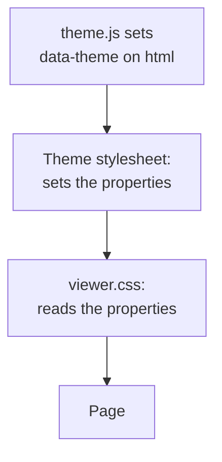

# Themes

A theme is one stylesheet that sets the colors, the fonts, and the corner
radii of the viewer. The viewer has a built-in theme. A project can
replace it with its own stylesheet.

## How a theme works

Each page loads two stylesheets in this sequence:

1. The theme stylesheet.
2. `viewer.css`.

`viewer.css` holds the structure of the page. It contains no color and no
font name. It reads CSS custom properties, such as `--bg-primary`. The
theme sets these properties.

A theme sets the properties two times: for
`html[data-theme="light"]` and for `html[data-theme="dark"]`. The script
`theme.js` sets `data-theme` on the `html` element before the first paint.
It uses the theme that the reader selected, else the setting of the
operating system. The script also sets `data-wrap` on the `html` element
when the reader set the [word wrap](NAVIGATION.md#word-wrap) to on.



## The built-in theme

Without `-theme`, the page loads `docsview/static/theme.css` from
`/_/static/theme.css`. This theme has the look of the default theme of
Obsidian: muted sidebars and a purple accent.

## Use a custom theme

1. Write a stylesheet that sets each [required property](#required-properties).
2. Give the path of the stylesheet to `-theme`:

   ```sh
   docs-viewer -theme ui/docs-theme.css
   ```

3. Open the viewer and examine the pages in light and in dark.

The path is absolute, or relative to the repository root. The file must
have the extension `.css`. If the file is absent, the viewer does not
start.

The custom stylesheet replaces the built-in theme fully. The page does not
load `theme.css`. Thus, a property that the custom theme does not set has
no value.

### Files that a theme can load

The viewer serves the theme at `/_/theme/<file name>`. It also serves each
`.css` and `.woff2` file below the directory of the stylesheet, with the
same relative path.

| File | URL |
|------|-----|
| `ui/docs-theme.css` (the value of `-theme`) | `/_/theme/docs-theme.css` |
| `ui/tokens.css` | `/_/theme/tokens.css` |
| `ui/fonts/Brand.woff2` | `/_/theme/fonts/Brand.woff2` |

Thus, a theme can import a file that is adjacent to it, and that file can
load a font:

```css
@import url("tokens.css");
```

These limits apply:

- The viewer serves no file above the directory of the stylesheet. Put the
  theme in the same directory as the files that it imports, or above them.
- The viewer serves only `.css` and `.woff2` files from that directory. It
  serves no hidden file.
- The content security policy permits no stylesheet and no font from
  another host. A theme cannot load a web font from a font service.
- The viewer reads the theme files from disk for each request. After you
  edit the theme, reload the page. Live reload does not monitor the theme.

## Required properties

The tables list each property that the built-in theme,
`docsview/static/theme.css`, sets. A theme must set each of them, unless
the row says that `viewer.css` does not read the property. Copy the
built-in theme to start a new theme.

Set the fonts and the radii one time, on `:root`. Set all other properties
for the two values of `data-theme`. Also set `color-scheme` to `light` or
`dark` in each block, so that the browser draws its own controls in the
correct colors.

### Fonts and radii

| Property | Use |
|----------|-----|
| `--font-text` | The font family of the text and of the viewer controls. |
| `--font-mono` | The font family of code. |
| `--radius-s` | The radius of small parts: buttons, tree rows, inline code, callouts. |
| `--radius-m` | The radius of code blocks, diagrams, inputs, and list entries. |
| `--radius-l` | The radius of the hover preview, the base picker, the graph controls, and the lightbox toolbar. |

### Accent

| Property | Use |
|----------|-----|
| `--accent` | The accent color: the focus ring, a selected check box, and the bar at the side of a block quote and of an embed. |
| `--accent-text` | The color of links and of the active outline entry. |
| `--accent-soft` | A weak accent background: tags, the search field focus. |
| `--accent-softer` | A weaker accent background: the active outline entry. |
| `--text-on-accent` | The color of the check mark on an accent background. |
| `--accent-h`, `--accent-s`, `--accent-l` | The hue, saturation, and lightness from which the built-in theme calculates the accent colors. `viewer.css` does not read them. A custom theme can omit them. |

### Backgrounds and borders

| Property | Use |
|----------|-----|
| `--bg-primary` | The background of the content and of the lightbox. |
| `--bg-primary-alt` | The background of keyboard keys (`kbd`). |
| `--bg-secondary` | The background of the sidebars, the graph controls, the lightbox toolbar, and the diff messages. |
| `--bg-secondary-alt` | A second sidebar background. `viewer.css` does not read it now. |
| `--bg-hover` | The background of a row or a button below the pointer. |
| `--bg-active` | The background of the selected row: the open file, the selected list entry. |
| `--bg-backdrop` | The layer behind a dialog and behind a sidebar in a narrow window. |
| `--border` | The standard border. |
| `--border-strong` | A border with more contrast: hover and open states. |
| `--divider` | The lines between the parts of the page, and the horizontal rule. |
| `--indent-guide` | The vertical lines of the file tree and of the search results. |

### Text

| Property | Use |
|----------|-----|
| `--text-normal` | The color of the text. |
| `--text-muted` | The color of secondary text. |
| `--text-faint` | The color of the weakest text: icons, list markers, the path in the header. |
| `--text-error` | Errors, the "connection lost" status, and removed lines in a diff. |
| `--text-success` | The "connected" status and added lines in a diff. |
| `--text-highlight-bg` | The background of highlighted text and of search terms. |
| `--line-target-bg` | The background of the target line on a source page (`#L10`). |
| `--text-selection` | The background of selected text. |

### Code and tables

| Property | Use |
|----------|-----|
| `--code-bg` | The background of code blocks and of inline code. |
| `--code-inline` | The text color of inline code. |
| `--code-text` | The text color of code blocks without a syntax color. |
| `--table-header-bg` | The background of the table header. |
| `--table-row-alt` | The background of each second table row. |

### Scrollbar and shadows

| Property | Use |
|----------|-----|
| `--scrollbar` | The color of the scrollbar. |
| `--scrollbar-hover` | The color of the scrollbar below the pointer. |
| `--shadow-s` | The shadow of small layers: the graph controls, the lightbox toolbar, the update message. |
| `--shadow-l` | The shadow of large layers: dialogs, the hover preview, the base picker. |

### Callout hues

| Property | Use |
|----------|-----|
| `--c-red` | The callouts `failure`, `danger`, and `bug`. Error boxes. |
| `--c-orange` | The callout `warning`. The label "Outside vault". Changed properties in a diff. |
| `--c-yellow` | The callout `question`. |
| `--c-green` | The callout `success`. The "copied" state of a copy button. |
| `--c-cyan` | The callouts `abstract` and `tip`. |
| `--c-blue` | The callouts `note`, `info`, and `todo`, and each other type. |
| `--c-purple` | The callout `example`. |
| `--c-grey` | The callout `quote`. |

Each `--c-*` value must be a complete color, for example
`rgb(233 49 71)` or `#e93147`. `viewer.css` mixes these colors with
`color-mix()` to make the weak backgrounds. A list of numbers, such as
`233 49 71`, does not work.

The API reference page also uses the hues for the HTTP methods. See
[API-SPECS.md](API-SPECS.md#theme).

### Graph

| Property | Use |
|----------|-----|
| `--graph-line` | A line between two nodes. |
| `--graph-line-highlight` | A line of the node below the pointer. |
| `--graph-node` | The node of a note. |
| `--graph-node-outside` | The node of a Markdown file outside the vaults. |
| `--graph-node-unresolved` | The node of a wikilink that finds no file. |
| `--graph-node-focused` | The node below the pointer. |
| `--graph-text` | The labels. |

## Optional properties

`viewer.css` gives each of these properties a fallback value. Set one only
to change it.

| Property | Use | Fallback |
|----------|-----|----------|
| `--font-heading` | The font family of the headings of level 1 and 2. | `inherit` (the text font) |
| `--heading-weight` | The font weight of those headings. | `700` for level 1, `650` for level 2 |
| `--heading-letter-spacing` | The letter spacing of those headings. | `-0.015em` for level 1, `-0.01em` for level 2 |
| `--h1-size` | The font size of a heading of level 1. | `1.802em` |
| `--h2-size` | The font size of a heading of level 2. | `1.5em` |
| `--h1-line-height` | The line height of a heading of level 1. | `1.2` |
| `--radius-pill` | The radius of a tag. | `2em` |
| `--tag-bg` | The background of a tag. | `var(--accent-soft)` |
| `--tag-bg-hover` | The background of a tag below the pointer. | The accent at 22 % |
| `--link-underline` | The color of the line below a link. | The accent at 35 % |

## Change a rule of `viewer.css`

The theme loads before `viewer.css`. When two rules have the same
specificity, the rule of `viewer.css` is the one that applies. Thus, a
theme rule that must replace a rule of `viewer.css` needs a higher
specificity. Start the selector with `html`.

The built-in theme has an example. Yellow text does not read on white, so
the light theme gives the `question` callout a darker color:

```css
/* No effect: viewer.css has the same selector and loads later. */
.callout[data-callout="question"] {
  --callout-color: rgb(196 145 0);
}

/* Correct: the selector has a higher specificity. */
html[data-theme="light"] .callout[data-callout="question"] {
  --callout-color: rgb(196 145 0);
}
```

`viewer.css` also sets sizes on `:root`, such as `--font-size`,
`--line-height`, and `--line-width` (the width of the reading column). A
`:root` block in a theme cannot change them. Use `html:root` or
`html[data-theme]`:

```css
html:root {
  --line-width: 52rem;
}
```

These sizes are not theme properties. Examine the result after each update
of the viewer.

## What a theme cannot change

- **Syntax colors.** The viewer generates them from two fixed styles of
  the chroma library: `github` for light and `github-dark` for dark.
- **Mermaid colors.** Diagrams use the Mermaid themes `default` and
  `dark`. Diagrams do use the text font of the theme.
- **The color of the tab icon.**

The icons are not theme properties.

The syntax colors and the diagrams always follow `data-theme`. Thus, give
each of the two blocks of a theme a background that agrees with it: a
light background for `light`, and a dark background for `dark`.

## Example: a theme from project tokens

This example is for a project that has a tokens file for its own user
interface. The tokens are dark by default.

```css
/* ui/tokens.css (part) */
@font-face {
  font-family: "Brand Sans";
  src: url("./fonts/Brand.woff2") format("woff2");
  font-weight: 100 900;
}

:root {
  --font-sans: "Brand Sans", system-ui, sans-serif;
  --font-code: ui-monospace, Menlo, Consolas, monospace;
  --brand-300: #9db8ff;
  --brand-400: #6f93f5;
  --brand-500: #3f66d9;
  --surface-0: #0f1115;
  --surface-1: #161920;
  --surface-2: #1e222b;
  --line-1: #2a2f3a;
  --line-2: #3b4250;
  --ink-1: #e7e9ee;
  --ink-2: #a8afbd;
  --ink-3: #6b7282;
}
```

The theme is a second file in the same directory. It has three parts: the
import, the alias block, and the light block.

```css
/* ui/docs-theme.css */
@import url("tokens.css");

/* Aliases: each viewer property from a project token. Dark is the default. */
:root {
  color-scheme: dark;

  --font-text: var(--font-sans);
  --font-mono: var(--font-code);
  --radius-s: 4px;
  --radius-m: 6px;
  --radius-l: 10px;

  --accent: var(--brand-400);
  --accent-text: var(--brand-300);
  --accent-soft: color-mix(in srgb, var(--accent) 16%, transparent);
  --accent-softer: color-mix(in srgb, var(--accent) 9%, transparent);
  --text-on-accent: #ffffff;

  --bg-primary: var(--surface-0);
  --bg-primary-alt: var(--surface-1);
  --bg-secondary: var(--surface-1);
  --bg-secondary-alt: var(--surface-2);
  --bg-hover: rgb(255 255 255 / 0.06);
  --bg-active: rgb(255 255 255 / 0.1);
  --bg-backdrop: rgb(0 0 0 / 0.5);
  --border: var(--line-1);
  --border-strong: var(--line-2);
  --divider: var(--line-1);
  --indent-guide: rgb(255 255 255 / 0.1);

  --text-normal: var(--ink-1);
  --text-muted: var(--ink-2);
  --text-faint: var(--ink-3);
  --text-error: #fb464c;
  --text-success: #44cf6e;
  --text-highlight-bg: rgb(255 208 0 / 0.3);
  --line-target-bg: color-mix(in srgb, var(--accent) 20%, transparent);
  --text-selection: color-mix(in srgb, var(--accent) 30%, transparent);

  --code-bg: var(--surface-1);
  --code-inline: var(--brand-300);
  --code-text: var(--ink-1);
  --table-header-bg: var(--surface-1);
  --table-row-alt: var(--surface-1);

  --scrollbar: rgb(255 255 255 / 0.13);
  --scrollbar-hover: rgb(255 255 255 / 0.25);
  --shadow-s: 0 1px 2px rgb(0 0 0 / 0.3), 0 2px 6px rgb(0 0 0 / 0.25);
  --shadow-l: 0 2px 8px rgb(0 0 0 / 0.3), 0 16px 48px rgb(0 0 0 / 0.5);

  --c-red: rgb(251 70 76);
  --c-orange: rgb(233 151 63);
  --c-yellow: rgb(224 222 113);
  --c-green: rgb(68 207 110);
  --c-cyan: rgb(83 223 221);
  --c-blue: rgb(2 122 255);
  --c-purple: rgb(168 130 255);
  --c-grey: rgb(158 158 158);

  --graph-line: rgb(255 255 255 / 0.14);
  --graph-line-highlight: var(--brand-400);
  --graph-node: var(--ink-3);
  --graph-node-outside: rgb(83 223 221);
  --graph-node-unresolved: var(--line-2);
  --graph-node-focused: var(--brand-400);
  --graph-text: var(--ink-1);

  /* Optional properties. */
  --heading-weight: 600;
  --radius-pill: 4px;
}

/* Light: only the values that are different. */
html[data-theme="light"] {
  color-scheme: light;

  --accent: var(--brand-500);
  --accent-text: var(--brand-500);
  --accent-soft: color-mix(in srgb, var(--accent) 12%, transparent);
  --accent-softer: color-mix(in srgb, var(--accent) 7%, transparent);

  --bg-primary: #ffffff;
  --bg-primary-alt: #fafafa;
  --bg-secondary: #f5f6f8;
  --bg-secondary-alt: #eceef2;
  --bg-hover: rgb(0 0 0 / 0.055);
  --bg-active: rgb(0 0 0 / 0.085);
  --bg-backdrop: rgb(0 0 0 / 0.22);
  --border: #e1e4ea;
  --border-strong: #cbd0da;
  --divider: #e1e4ea;
  --indent-guide: rgb(0 0 0 / 0.1);

  --text-normal: #1d2129;
  --text-muted: #565d6b;
  --text-faint: #9299a6;
  --text-error: #d7263d;
  --text-success: #0a8f43;
  --text-highlight-bg: rgb(255 208 0 / 0.4);
  --line-target-bg: color-mix(in srgb, var(--accent) 13%, transparent);
  --text-selection: color-mix(in srgb, var(--accent) 20%, transparent);

  --code-bg: #f4f5f7;
  --code-inline: var(--brand-500);
  --code-text: #33373f;
  --table-header-bg: #f5f6f8;
  --table-row-alt: #fafbfc;

  --scrollbar: rgb(0 0 0 / 0.16);
  --scrollbar-hover: rgb(0 0 0 / 0.3);
  --shadow-s: 0 1px 2px rgb(0 0 0 / 0.06), 0 2px 6px rgb(0 0 0 / 0.05);
  --shadow-l: 0 2px 8px rgb(0 0 0 / 0.07), 0 12px 40px rgb(0 0 0 / 0.14);

  --c-red: rgb(233 49 71);
  --c-orange: rgb(236 117 0);
  --c-yellow: rgb(224 172 0);
  --c-green: rgb(8 185 78);
  --c-cyan: rgb(0 191 188);
  --c-blue: rgb(8 109 221);
  --c-purple: rgb(120 82 238);
  --c-grey: rgb(140 140 140);

  --graph-line: rgb(0 0 0 / 0.16);
  --graph-line-highlight: var(--brand-500);
  --graph-node: #8c8c8c;
  --graph-node-outside: rgb(0 191 188);
  --graph-node-unresolved: #c4c4c4;
  --graph-node-focused: var(--brand-500);
  --graph-text: #333333;
}

/* Yellow text does not read on white. */
html[data-theme="light"] .callout[data-callout="question"] {
  --callout-color: rgb(196 145 0);
}
```

Notes on the example:

- The `@import` rule is the first rule of the file. CSS ignores an
  `@import` rule that comes after another rule.
- The alias block is on `:root`, so it applies to the two values of
  `data-theme`. The light block has a higher specificity, so its values
  replace the aliases when `data-theme` is `light`.
- A value such as `color-mix(in srgb, var(--accent) 16%, transparent)`
  uses the accent of the active block. The light block sets it again only
  to change the percentage.
- The fonts and the radii are the same in light and in dark. Only the
  alias block sets them.

Run the viewer with the theme:

```sh
docs-viewer -theme ui/docs-theme.css
```

## How it was checked

- `TestTheme` in `docsview/docsview_test.go` covers the `-theme` path
  rules, the sequence of the stylesheets in the page, the files that
  `/_/theme/` serves, and the files that it refuses.
- `TestThemeProperties` reads `viewer.css` and the scripts. It fails when
  they read a property without a fallback that no stylesheet sets.
